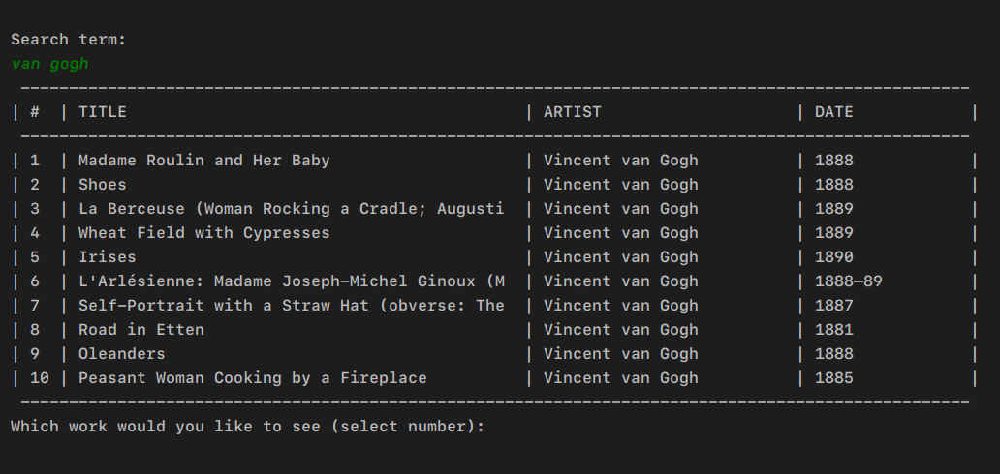

# SimpleArtViewer

SimpleArtViewer searches for public domain artworks in the Metropolitan Museum of Art Collection, using the museum's public API.

**This project was developed only as a way to get familiar with Java**, so it was mostly a learning experience. I'll leave it open, since it was quite fun and simple to do, and it might help in any way a lost soul that eventually finds their way here.

Some further development could add the following:

* Local user profiles, which allows the user to create an artwork library
* More terminal command options, replacing the current search/view artwork cycle
* Search filtering type (e.g., by artist, artwork title, artwork type), and eventually combine those.

## What it does
Quite simply, it searches de database for a given keyword, and after selecting an artwork it will open the image file so that you can fully enjoy it. Looking at paintings is nice.

## Screenshot
Search result table example:

## Usage
* Download/clone the repository
* Compile
* Ru
